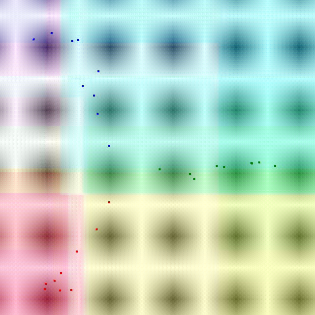

## Overview
This is a javascript random forest implementation. It supports multiple classes;
it accepts numerical input vectors and string outputs labels.

## Usage
```
var forest = new Forest();
forest.train([
    [0,0,1],
    [0,1,0],
    [0,1,1],
    [1,0,0],
    [1,0,1],
    [1,1,0]
], ["a", "b", "c","d","e","f"]);
assert.equal(forest.predict([0,0,1])[0].label, "a");
assert.equal(forest.predict([0,1,0])[0].label, "b");
assert.equal(forest.predict([0,1,1])[0].label, "c");
assert.equal(forest.predict([1,0,0])[0].label, "d");
assert.equal(forest.predict([1,0,1])[0].label, "e");
assert.equal(forest.predict([1,1,0])[0].label, "f");
```

## Demo
 - This example (see demo/demo_rgb.htm) allows users to add red, green, or blue
   points to the map. A decision tree learns those data points and predicts the
   colors for the rest of the map.

   

## Todo
- k-fold cross-validation
- performance comparisons
- documentation + examples

## License
The MIT License
